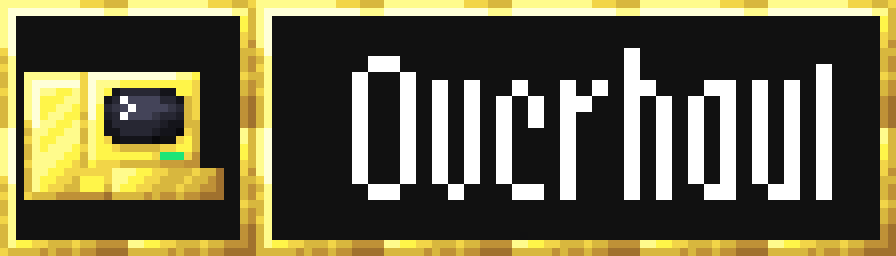
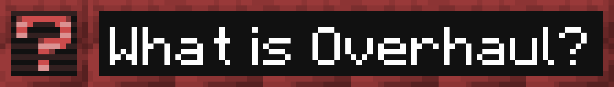
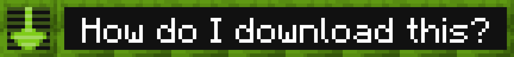
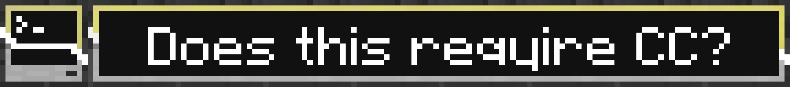
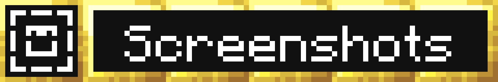
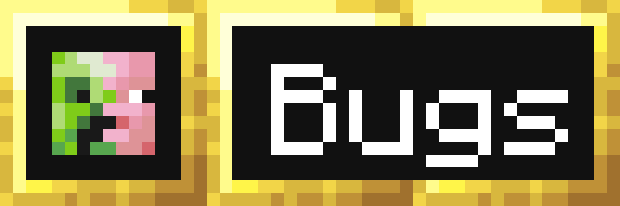
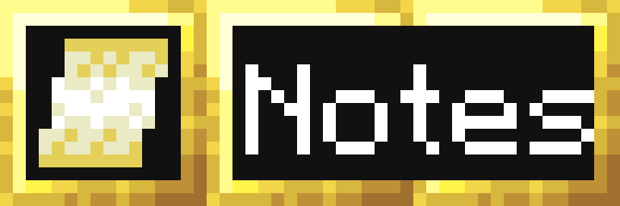

***Done-ish.***

This is **Overhaul** pack; a project by 3prm3 which overhauls CC's textures and models.

Click the green "code" button and then click download zip (then extract and put the cc-overhaul-main folder into resource packs if needed).
You can also get overhaul from [here](https://github.com/cc-orgs/cc-overhaul/releases).

Yes! This is a texture pack for Computercraft and as such requires it to work though it works best with CC:R which fixes a command computer rendering bug.

[CC: Tweaked](https://github.com/cc-tweaked/CC-Tweaked) has a bug where the command computer has different properties than all other computers which makes them see-through in the bottom. This also used to be in older CC:R versions but has since been patched

If you are using [CC: Restitched](https://github.com/cc-tweaked/cc-restitched) then this pack is already included and its name will be`computercraft/overhaul`.
This pack is currently on its third revision which replaces all known vanilla edits with new Jappa/industrial-styled custom textures.

